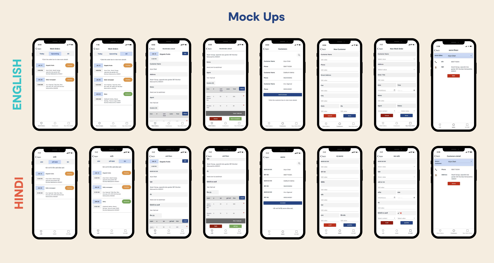

# eKhata-CustomerOrderManagement
**Empowering Local Vendors One Day at a Time**

## Overview

eKhata is a mobile-first platform aimed at empowering local street vendors by providing an easy-to-use, efficient solution for managing work orders, customer information, and invoices. Street vendors often face challenges with customer management, tracking orders, and handling monthly credit systems. eKhata addresses these challenges by offering a digital tool that helps vendors streamline their business processes, improve order tracking, and build stronger relationships with their customers.

By offering bilingual support (English and Hindi), eKhata makes sure that even underserved communities can benefit from a transparent and intuitive design, ultimately fostering trust between vendors and their customers.

---

## Key Features

### 1. **Work Order Management**
   - **Assign and Track Orders**: Vendors can assign customer orders and track their progress by marking them as completed, pending, or delivered.
   - **Quick Order Access**: Repeat orders are made simple by allowing vendors to quickly edit and reorder based on customer needs.
   - **Delivery and Timing**: Vendors can store essential order details, such as delivery addresses, dates, and item specifics.

### 2. **Invoice Creation and Sharing**
   - **Customizable Invoices**: Generate detailed invoices, including itemized lists and the final billed amount.
   - **JPEG Export**: Vendors can export invoices as images, making it easy to share them with customers via popular messaging platforms.

### 3. **Customer Relationship Management (CRM)**
   - **Customer Profiles**: Save important customer information such as names, addresses, and preferences.
   - **Customer Preferences**: Personalize services by remembering customer preferences for future orders, creating a more personalized customer experience.

### 4. **Bilingual Functionality**
   - **English and Hindi**: The app supports both English and Hindi, allowing vendors to choose their preferred language for a smoother user experience.

### 5. **User-Centric Design**
   - **Lightweight Interface**: The app is designed to consume minimal data and is easy to navigate, even in low-connectivity areas. 
   - **Optimized for Mobile**: Built for low-spec devices, ensuring vendors can use it without the need for high-end technology.

---

## Visual Mockups

eKhata has been designed with a clean, intuitive interface. Below are some of the mockups showing both English and Hindi interfaces:

---

## Mission

eKhata’s mission is to equip local street vendors with the tools they need to enhance their business processes and customer interactions. By simplifying the management of orders and customer data, eKhata allows vendors to focus on growing their businesses, strengthening customer relationships, and reducing the risk of mismanagement or lost orders.

### Impact

- **Reduced Errors**: eKhata helps vendors reduce calculation mistakes and order mix-ups, directly improving their business efficiency.
- **Customer Trust**: With clear records of transactions and professional invoices, vendors can build stronger, trust-based relationships with their customers.
- **Accessibility**: By supporting both English and Hindi, eKhata ensures that the platform is accessible to a broader range of users, including those in underserved communities.

---

## The Future of eKhata

Our goal is to continuously evolve the platform by incorporating feedback from vendors and customers alike. Future features may include:

- **Cloud Syncing**: Enable real-time order syncing between vendors and their customers.
- **Analytics Dashboard**: Equip vendors with tools to track their sales performance and customer preferences.
- **Offline Functionality**: Allow vendors to manage their orders even when internet access is unavailable.
- **Community Network**: Provide a platform for vendors to share resources, collaborate, and grow their businesses together.

---

## Why eKhata?

Street vendors are an essential part of local economies, yet they often lack the tools to manage their business efficiently. eKhata is designed to close this gap by giving vendors a simple, accessible way to manage orders and customer relationships without requiring technical expertise or advanced equipment.

The app is lightweight, easy to use, and helps vendors save time, reduce errors, and improve customer satisfaction. It empowers them to focus on what they do best: serving their communities.

---

## Contact

For any questions, collaborations, or more information, feel free to reach out:

- **Email**: veer.kejriwa11@gmail.com
- **LinkedIn**: [Veer Kejriwal](https://www.linkedin.com/in/VeerKejriwal)

---

**Empowering Local Vendors, One Day at a Time.**
